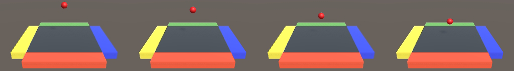

# Unity-GPU-JPEG-Compression

Develop a method for compressing GPU textures using the JPEG specification, in Unity, and then evaluate its performance.

# Project Objectives

1. Understand how JPEG compression works to reduce the size of raw image data
2. Understand the Unity Rendering pipeline
3. Investigate different methods currently used for on-GPU JPEG compression
4. Investigate the current performance of image generation and saving in Unity.
5. Select a suitable approach and implement a prototype.
6. Measure performance (both Unity performance and render quality) of the system after your custom
on-GPU compressor is used and note any improvements. Determine if there is a performance
improvement

# Repo Structure
```
GitHub Landing Page: Explains repository structure and contains a single Unity project for all possible solutions
├── Assets: Contains all resources required for Unity
│   ├── Lighting: Contains the lighting maps for the scenes
│   ├── Materials: Contains different materials for the objects in the scenes
│   ├── Plugins: Contains compiled DLLs from the Native Plugins
│   |   ├── CUDA_OpenGL_Interop: library to be imported for use with CUDA OpenGL Interop
│   |   └── DirectX11: library to be imported for use with DirectX 11
│   ├── Prefabs: Contains prefab objects to spawn into the scenes
│   |   ├── DynamicSceneBall: prefab ball for Dynamic Scene to destroy and instantiate 
│   |   ├── PhysicsSceneBall: prefab ball for Physics Scene to destroy and instantiate
│   |   └── VisualsSceneBall: prefab ball for Visuals Scene to destroy and instantiate
│   ├── Scenes: Contains the scenes used to test the pipeline
│   |   ├── Static: single ball with no physics simulation 
│   |   ├── Dynamic: single ball with physics simulation 
│   |   ├── Physics: multiple balls with physics simulation 
│   |   └── Visuals: single ball with physics simulation and post-processing effects 
│   └── Scripts: Contains C# scripts used in the project
│       ├── CurrentPerformance: contains C# script related to current methods in Unity
│       |   ├── CameraScript: main script that acts as a camera controller
│       |   ├── LinearScript: take image using a linear coding approach
│       |   └── CoroutinesScript: take image using a coroutines coding approach 
│       └── NativePlugins: contains C# script related to alternative methods in Unity
│           ├── DirectX11CameraScript: main camera controller script for DirectX 11
│           ├── DirectX11Script: take image using imported DirectX 11 DLL
│           ├── CUDAOpenGLCameraScript: main camera controller script for CUDA OpenGL Interop
│           └── CUDAOpenGLScript: take image using imported CUDA OpenGL Interop DLL
|
├── NativePlugins: Visual Studio project containing all resources required for C++ Plugins
│   ├── CUDA_OpenGL_Interop: Source code for the CUDA Interoperability with OpenGL Plugin
│   ├── DirectX11: Source code for the DirectX 11 Plugin
│   ├── DirectXTK: Package containing helper classes for writing DirectX 11 C++ code 
│   └── x64/Debug: Contains compiled DLLs from Visual Studio
|
├── Packages: Contains packages installed from the Unity Package Manager
|
├── RepoImages: Contains images for banners and logos
|
└── README.md
```

# Requirements

Below is a list of hardware and software you will need to get started:

- Hardware
    - CUDA-enabled NVIDIA Graphics Card
    - At least 8GB Ram
- Software
    - Windows 10 (note that other Windows versions have NOT been tested)
    - Unity 2020.3 LTS (note that other Unity versions have NOT been tested)
